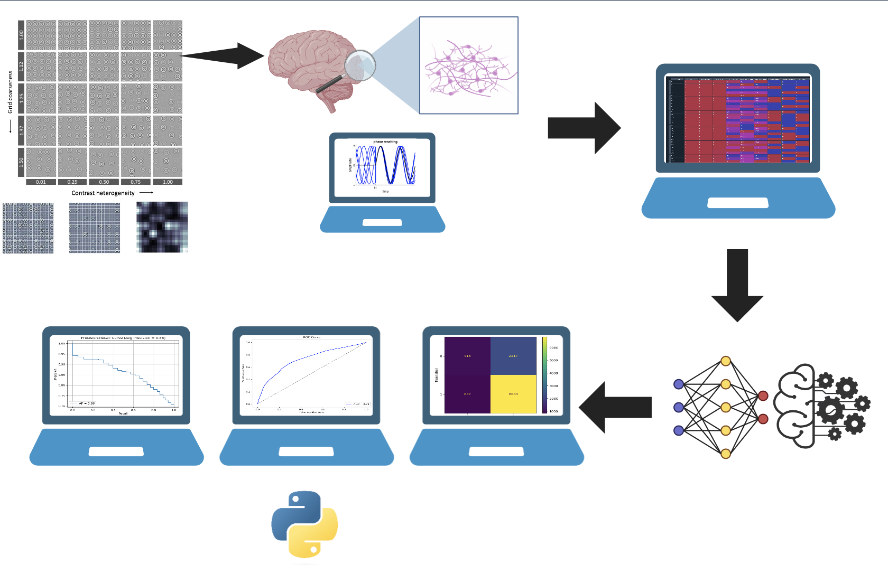
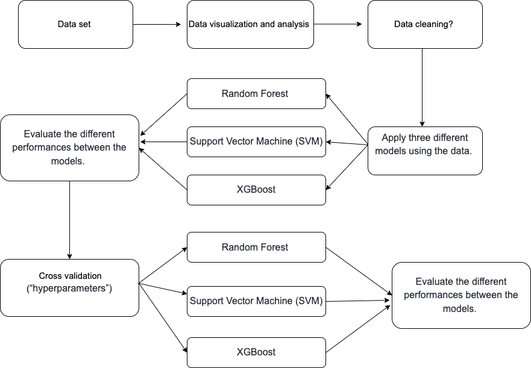

# Classifying Figure-Ground Segregation Using Gamma-Oscillations in V1 with Machine-Learning
The next project has the aim to apply Machine Learning techniques, in order to investigate the relationships between the gamma oscillations in the primary visual cortex (V1) and figure-ground segregation in texture stimuli. Using features like Contras Heterogeneity and Grid Coherence, we can explore how the gamma synchronization influences visual processing. Moreover a comparison between the models with and without cross-validation was performed, with the purpose to determine the influence of the hyperparameters in the performance of the models. 
## Machine Learning Models: 
- Random Forest (RF). 
- Support Vector Machine (SVM). 
- XGBoost.
  
The code can be run in any computer with the correct libraries pre installed (e.g., scikit-learn, XGBoost, etc.) and making adjustments to the data file paths to suit your local environment. The main code contains the whole performance in a Jupyter Notebook, while the code of each model and simulation with and without cross-validation hyperparameters can be found individually. 

The  complete and original data can be founded here:  

